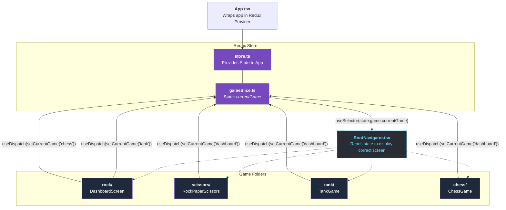

# Redux Architecture in ReactXNative

Redux acts as the central brain of our application. Instead of passing data manually from folder to folder, every game connects directly to the store. 

Here is a visual map showing how the different folders in your app interact with Redux:

## How the Diagram Works

1. **The Core (Top):** [App.tsx](file:///Users/fendy24/Downloads/reactxnative/App.tsx) provides the store to the entire app. The store gets its intelligence from [gameSlice.ts](file:///Users/fendy24/Downloads/reactxnative/src/store/gameSlice.ts), which holds the state variable `currentGame`.
2. **The Decision Maker (Middle):** [RootNavigator.tsx](file:///Users/fendy24/Downloads/reactxnative/src/RootNavigator.tsx) functions like a traffic cop. It constantly monitors Redux via `useSelector`. If `currentGame` changes to `'tank'`, it hides the dashboard and renders the TankGame folder.
3. **The Game Folders (Bottom):** Each of the folders (`rock/`, `scissors/`, `tank/`, `chess/`) are isolated and independent. However, they all have the power to send remote controls back to the Redux Brain using `useDispatch()`.

When you click a button in the **Dashboard** inside the `rock` folder, it shoots a message up to Redux to change the state. Redux immediately tells the **RootNavigator** about the change, and the **RootNavigator** swaps the screens instantaneously!
